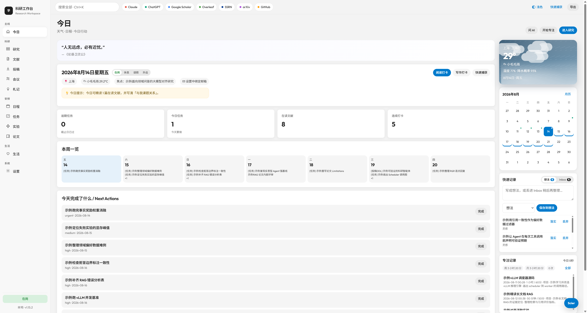
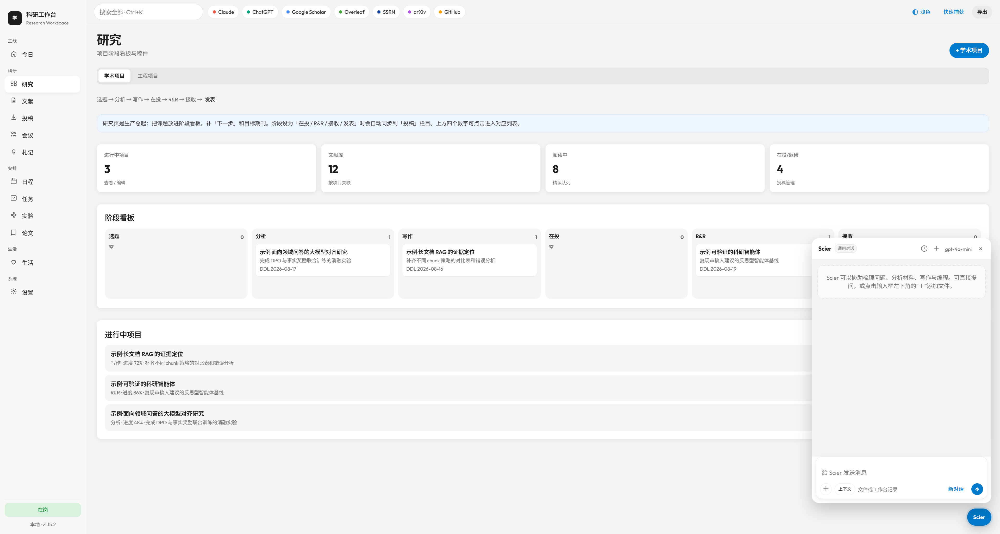
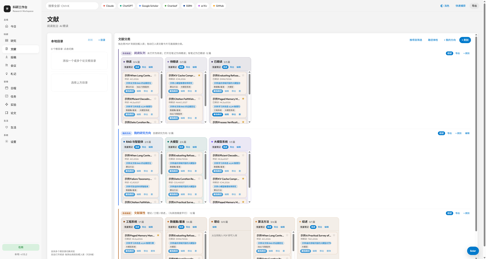
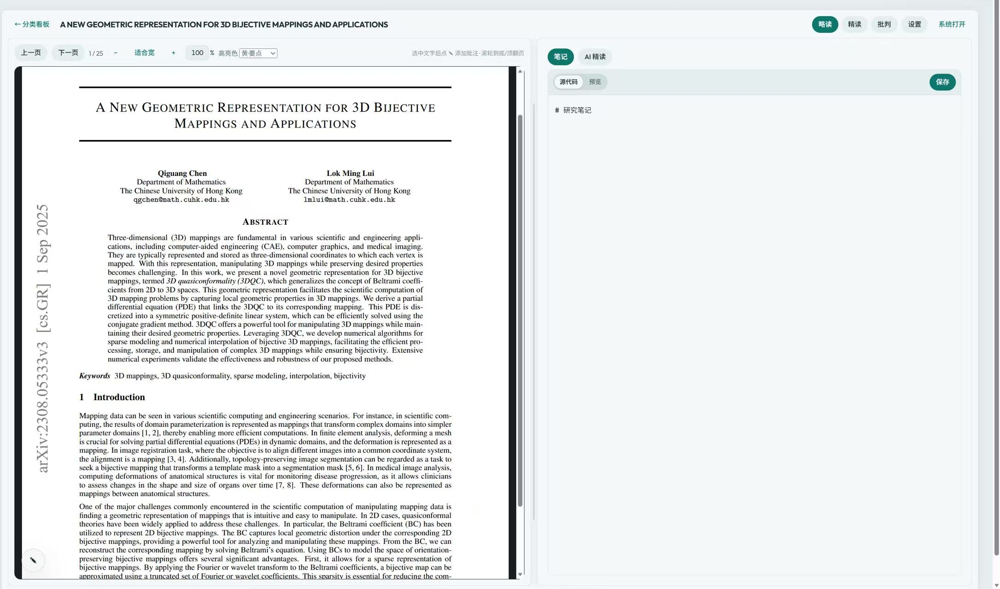
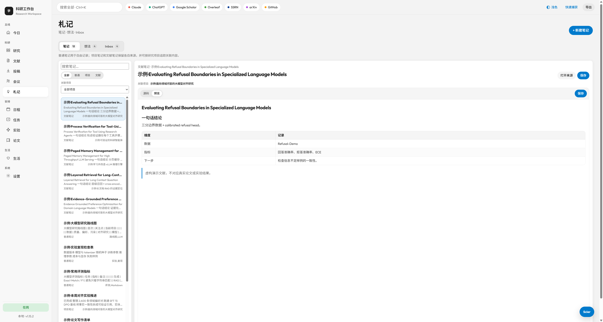
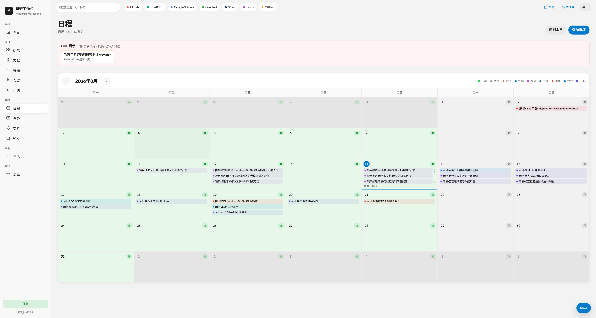
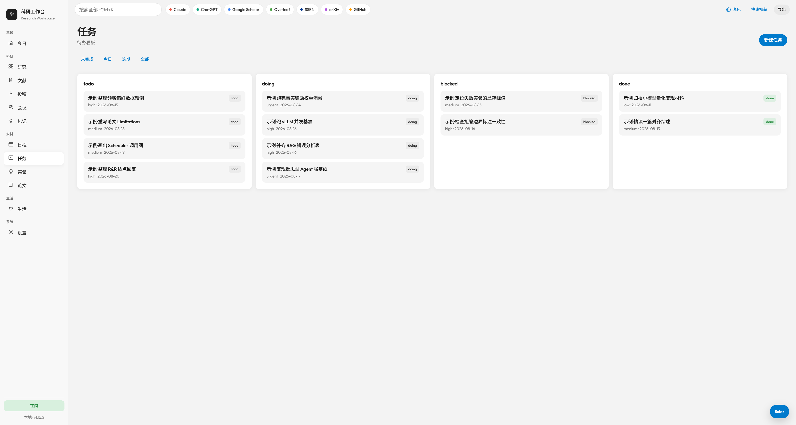
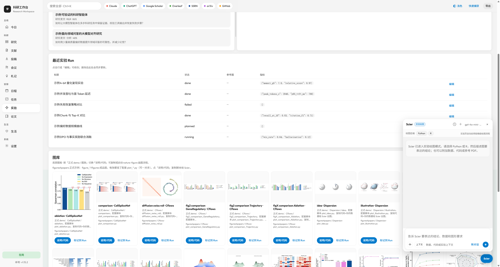
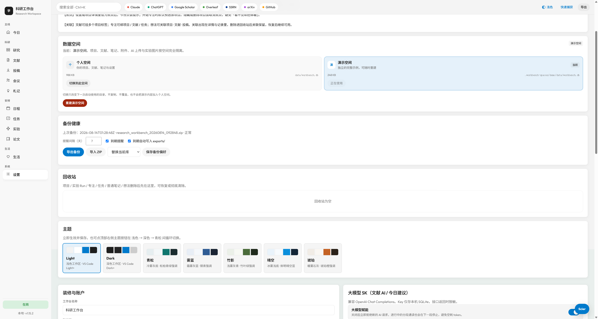
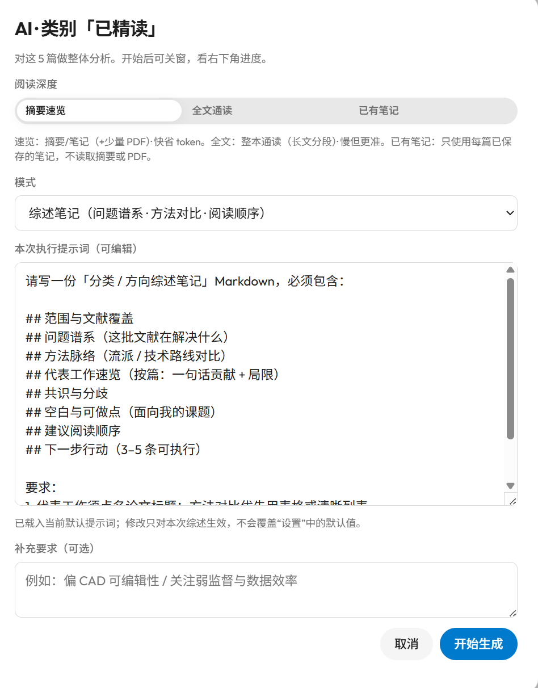

# 科研工作台 · Research Workbench

面向 AI / 计算机方向研究者的本地优先科研工作台。

把文献阅读、学术项目、开源工程学习、实验、札记、任务、日程、投稿和 AI 协作放进一个可以互相关联的工作空间。数据默认保存在自己的电脑中，不需要注册云端账号。

<p align="center">
  
  
  
  
  <a href="LICENSE"></a>
</p>

> 项目仍在持续开发。首次启动会自动创建一套可删除的演示数据，让你先看懂完整工作流，再换成自己的项目和文献。

---

## 它解决什么问题

科研信息往往散落在 PDF 文件夹、笔记软件、待办工具、日历、实验目录和聊天窗口中。真正困难的不是“再记录一条”，而是让记录能够回到正在推进的研究主线。

科研工作台围绕几个核心关系设计：

```text
文献 ── 精读笔记 ──┐
                    ├── 学术项目 ── 实验 ── 投稿
想法 / Inbox ──────┤       │
                    │       ├── 任务 / 日程 / 专注
普通札记 ──────────┘       │
                            └── Scier 上下文

开源仓库 ── 工程项目 ── 架构 / 环境 / 技术 / 踩坑 / 决策
```

## 功能概览

### 今日

- 今日任务、近期日程、个人状态与天气
- 可关联项目、文献或任务的专注计时
- 快速捕获到想法或 Inbox
- 根据项目笔记、项目专注和文献阅读形成推进记录

### 研究：学术项目与工程项目

研究模块采用双轨设计。

学术项目用于论文研究：

- 选题 → 分析 → 写作 → 在投 → R&R → 接收 → 发表
- 记录研究问题、贡献、完成标准、下一步和目标会议/期刊
- 关联文献、任务、实验、投稿、专注与 Markdown 项目笔记

工程项目用于学习优秀开源项目：

- 待考察 → 架构拆解 → 环境搭建 → 最小复现 → 改造实践 → 已沉淀
- 记录源仓库、官方文档与本地工作区
- 按学习过程、架构、环境、关键技术、踩坑、工程决策、可复用结论沉淀记录
- 每条工程记录可填写来源和代码位置

### 文献

- 扫描一个或多个本地 PDF 目录，支持手动刷新
- 待入库列表可在资源管理器中快速定位文件
- 入库时自动尝试解析文章标题，并把文章名写回文献库
- 分类看板支持研究方向、文献属性和阅读队列，文献可拖动换分类
- 项目标签、来源（如 `ICCV2026`）、重要文献标星
- 阅读队列自动流转：
  - 入库后尚未打开：待读
  - 已打开但没有笔记：待精读
  - 已写笔记：已精读
- 分类计数显示为“已精读 / 总数”
- 双击进入内置 PDF 阅读器，返回后保持分类看板和左侧目录滚动位置
- 阅读器支持略读 / 精读模式、批注、Markdown 文献笔记和 `Ctrl/Cmd + S`
- AI 笔记支持单篇与批量；综述可使用摘要、全文或现有笔记作为输入
- AI 笔记与综述执行前先显示默认提示词，可编辑后再运行

### 札记

札记不是把想法换一个名字，而是统一容纳三种内容：

- 笔记
  - 普通笔记
  - 项目笔记
  - 文献笔记（自动隐藏空白文献笔记）
- 想法
- Inbox

笔记与想法采用非弹窗的双栏页面，正文使用 Markdown，支持源码 / 预览、GFM 表格、KaTeX 公式和快捷保存。笔记还可以按关联项目查看。

公式示例：

```latex
$$
x_{\mathrm{CAD}} \xrightarrow{E} z \in \mathbb{R}^{256}.
$$
```

旧式的独立方括号也会在预览前做兼容处理，但建议新笔记优先使用标准的 `$$ ... $$` 块公式。

### 实验

- 按研究项目管理实验 Run
- 记录假设、参数、指标、状态、结论与失败原因
- 图库提供可参考的科研图类型、预览和代码包
- 画图入口只在实验相关场景自动出现
- 实验实体可以直接作为 Scier 上下文

### 投稿、会议、任务、日程、论文与生活

- 投稿：项目、目标会议/期刊、状态和事件时间线；会议库和期刊库支持筛选、全选、批量编辑与批量删除
- 会议：议程、纪要、决策与行动项
- 任务：优先级、截止日期、项目关联和完成状态
- 日程：任务、会议、DDL、专注与个人状态汇总
- 论文：毕业论文结构、章节状态和里程碑
- 生活：饮食、运动、清单、纪念日与事务记录

### Scier

Scier 是工作台中的浮动 AI 协作者。

- 通用对话与实验画图模式分开
- 支持添加 PDF、Markdown、代码、CSV、JSON 等文件
- 可浏览并选择项目、项目笔记、工程记录、文献、文献笔记、投稿、会议、札记、任务、实验、论文和生活记录作为上下文
- 在研究或文献界面可以把实体直接拖入 Scier
- 拖入本地文献时，除元数据外会尽可能读取 PDF 正文作为上下文
- 发送后显示运行状态；用户消息可编辑并重新发送
- AI 返回内容按 Markdown 渲染并可复制
- 对话自动保存，可从顶部时钟图标查看历史或新建对话

Scier 完全可选。未配置 API Key 时，其余功能照常使用。

---

## 界面预览

<p align="center">
  
</p>

| 研究项目与 Scier | 文献分类看板 |
| :---: | :---: |
|  |  |

| PDF 阅读与 Markdown 笔记 | 札记工作区 |
| :---: | :---: |
|  |  |

| 科研日历 | 任务看板 |
| :---: | :---: |
|  |  |

| 实验与科研绘图库 | 数据空间与设置 |
| :---: | :---: |
|  |  |

<p align="center">
  <strong>AI 笔记与综述执行前可编辑提示词</strong><br /><br />
  
</p>

> 截图使用演示空间数据，具体功能以最新版为准。

---

## 快速开始

### 桌面安装包

不想配置 Python 环境时，可以直接使用已经打包好的 Windows 或 macOS 桌面版：

- [前往科研工作台下载页](https://gitee.com/fasuiker/research-workbench-downloads/releases)
- Windows 下载 `.exe`，macOS 下载 `.dmg`

Windows 版会以独立桌面窗口运行，程序文件安装在用户目录，个人数据保存在：

```text
%LOCALAPPDATA%\ResearchWorkbench
```

升级或卸载程序不会主动删除该目录中的个人数据库、PDF、笔记与附件。安装包尚未购买代码签名证书时，系统可能显示“未知发布者”；请只从上方发布页下载，并核对页面提供的 SHA256。

### 开发者：从源码运行

### 环境要求

- Python 3.10 或更高版本
- Windows、macOS 或 Linux
- 推荐使用 Conda；普通 `venv` 也可以

### 方式一：Conda

```bash
git clone https://github.com/Fasuiker/research_workbench.git
cd research_workbench

conda create -n phdbench python=3.10 -y
conda activate phdbench
pip install -r requirements.txt
python run.py
```

也可以直接使用环境文件：

```bash
conda env create -f environment.yml
conda activate phdbench
python run.py
```

### 方式二：venv

Windows PowerShell：

```powershell
git clone https://github.com/Fasuiker/research_workbench.git
cd research_workbench
py -3.10 -m venv .venv
.\.venv\Scripts\Activate.ps1
pip install -r requirements.txt
python run.py
```

macOS / Linux：

```bash
git clone https://github.com/Fasuiker/research_workbench.git
cd research_workbench
python3 -m venv .venv
source .venv/bin/activate
pip install -r requirements.txt
python run.py
```

启动后打开：<http://127.0.0.1:8787>

### Linux / WSL 可选：tmux 常驻

```bash
chmod +x scripts/wb-server.sh
./scripts/wb-server.sh start
./scripts/wb-server.sh status
./scripts/wb-server.sh attach   # Ctrl+b，再按 d 可脱离
./scripts/wb-server.sh stop
```

---

## 数据空间与默认演示数据

设置页提供两个完全隔离的数据空间：

- **个人空间**：你的真实项目、文献、札记、附件和 AI 配置，继续使用 `data/`
- **演示空间**：完整默认示例，保存在 `.workbench-spaces/demo/`

切换时应用会自动重启。它只改变当前使用的目录，不复制、不覆盖，也不会把演示记录混入个人数据库。切回个人空间后，原来的内容和使用状态都会保留。

全新安装第一次启动默认进入“大模型科研”演示空间，包括：

- 对齐、RAG、科研智能体、小模型效率等 4 个不同论文阶段的学术项目，以及一个 vLLM 工程学习项目
- 12 篇虚构大模型文献，覆盖待读、待精读、已精读和标星；其中 5 篇带完整 Markdown 精读笔记
- 待办、进行中、阻塞、已完成等 12 条任务，以及计划中、运行中、成功、失败等实验 Run
- 写作、内部评审、已投稿、返修、接收、拒稿等不同阶段的投稿记录和事件时间线
- 项目笔记、工程架构 / 技术 / 环境 / 踩坑 / 决策记录，普通笔记、想法、Inbox、日程、专注与会议
- 两条离线 Scier 历史对话和一套大模型方向的毕业论文总览

所有演示业务记录都以 `示例·` 开头。文献标题、作者、DOI、摘要和实验数值均为虚构演示内容，不附带 PDF，也不会伪造本地文件路径或被误当成真实引用。

数据空间遵循以下规则：

| 场景 | 行为 |
| --- | --- |
| 第一次启动且没有个人数据库 | 进入独立演示空间并创建完整示例 |
| 已有安装升级 | 默认继续进入现有个人空间 |
| 切换到个人空间 | 使用原 `data/workbench.db`；不存在时创建干净工作台 |
| 切换到演示空间 | 使用独立演示库；不存在时自动创建 |
| 在演示空间点击“重建演示空间” | 只清空并重建演示库，不影响个人空间 |
| 使用 `WORKBENCH_DATA_DIR` | 显示为自定义空间，并停用界面切换以避免路径冲突 |

开发者可以运行隔离验证：

```bash
python scripts/verify_fresh_install.py
```

脚本只在系统临时目录创建数据库，并验证第二次初始化不会产生重复数据。

---

## 数据、隐私与备份

默认空间位置：

```text
个人空间：data/workbench.db
演示空间：.workbench-spaces/demo/data/workbench.db
当前选择：.workbench-profile.json
```

本地 PDF、AI 上传文件和实验图片也保存在本机目录。仓库通过 `.gitignore` 排除以下内容：

- `data/*`
- `.workbench-spaces/`
- `.workbench-profile.json`
- `exports/*`
- `papers/**`
- `*.db`、`*.db-wal`、`*.db-shm`
- `.env` 与日志文件

因此正常的 `git add` / `git push` 不会上传个人数据库、PDF、API Key 或导出备份。

应用默认只监听 `127.0.0.1`。如无明确的网络隔离和身份认证方案，请不要直接改成公网监听。

### 自定义数据目录

可通过环境变量把真实数据与代码目录分开：

使用自定义目录时，设置页会显示“自定义空间”。为避免界面选择与环境变量冲突，此时个人/演示切换按钮会停用。

PowerShell：

```powershell
$env:WORKBENCH_DATA_DIR = "D:\ResearchWorkbenchData"
$env:WORKBENCH_EXPORT_DIR = "D:\ResearchWorkbenchExports"
python run.py
```

macOS / Linux：

```bash
export WORKBENCH_DATA_DIR="$HOME/.local/share/research-workbench"
export WORKBENCH_EXPORT_DIR="$HOME/Documents/research-workbench-exports"
python run.py
```

### 备份与迁移

- 在设置中导出 ZIP 快照
- ZIP 包含结构化 JSON 和 SQLite 数据库副本
- 在另一台设备安装相同或更新版本后，从设置中导入
- 更新代码前建议先导出一次快照

---

## AI 配置

在“设置”中填写兼容 OpenAI Chat Completions 的：

- Base URL
- API Key
- 模型名称
- 默认文献阅读模式
- AI 笔记与综述提示词

API Key 只写入本地数据库。不要把数据库、备份或含密钥的环境文件提交到公开仓库。

批量全文处理会消耗更多时间与 token，建议先选少量文献验证提示词。只想基于自己写过的内容做综述时，可以选择“笔记”作为输入。

---

## 更新已有安装

```bash
cd research_workbench
git pull
conda activate phdbench        # 或激活你的 venv
pip install -r requirements.txt
python run.py
```

应用启动时会执行向后兼容的 SQLite 迁移。已有数据库不会因为更新而被默认演示数据覆盖。

推荐更新前先在设置中导出 ZIP 快照。若你修改过源代码，请先提交或备份本地改动再拉取。

---

## 项目结构

```text
research_workbench/
├── app/
│   ├── routers/              # FastAPI 接口
│   ├── services/             # 迁移、默认数据、AI、文件与业务服务
│   ├── models.py             # SQLAlchemy 数据模型
│   └── main.py               # 应用入口
├── static/                   # 原生 JS 单页界面与样式
├── scripts/                  # 启动、Windows 文件定位、安装验证脚本
├── docs/                     # PRD、数据模型、API 与模块文档
├── data/                     # 个人数据，Git 默认忽略
├── exports/                  # 本地备份，Git 默认忽略
├── requirements.txt
├── environment.yml
└── run.py
```

更多设计资料：

- [文档索引](docs/00-INDEX.md)
- [产品需求](docs/01-PRD.md)
- [数据模型](docs/03-DATA-MODEL.md)
- [API](docs/04-API.md)
- [模块说明](docs/05-MODULES.md)
- [LLM 策略](docs/06-LLM-STRATEGY.md)
- [更新日志](CHANGELOG.md)

---

## 技术栈

| 层 | 技术 |
| --- | --- |
| 后端 | FastAPI、SQLAlchemy、Pydantic、Uvicorn |
| 存储 | SQLite WAL、本地文件系统 |
| 前端 | 原生 JavaScript SPA、HTML、CSS |
| 文献 | PDF.js、pypdf |
| Markdown | Marked、KaTeX、GFM 表格扩展 |
| 天气 | Open-Meteo |
| AI | 兼容 OpenAI Chat Completions 的服务 |

设计原则：本地优先、单人使用、数据可迁移、关系可追踪、依赖尽量少。

---

## 贡献

欢迎提交 Issue 或 Pull Request。

1. Fork 仓库并创建功能分支
2. 保持改动聚焦，沿用现有视觉和交互语言
3. 数据模型变更必须为已有 SQLite 提供兼容迁移
4. 新功能应同步默认演示数据与相关文档
5. 提交前运行：

```bash
python -m compileall app
python scripts/verify_fresh_install.py
```

## 版权与许可证

Copyright © 2026 Fasuiker。项目采用 [PolyForm Noncommercial License 1.0.0](LICENSE)，属于“源码可用”项目，而不是允许任意商业使用的 MIT 开源项目。

你可以在个人学习、科研、教学、公益研究等非商业场景中免费使用、修改和分享，但必须保留许可证与版权声明。未经作者书面许可，不得：

- 将本项目、修改版或打包版直接销售；
- 以付费下载、付费安装、商业托管或商业 SaaS 的形式提供；
- 更换名称、图标或包装后作为自己的商业产品出售；
- 删除、隐藏或虚假替换原作者及许可证信息。

如需公司内部商业使用、商业集成、付费分发或其他商业授权，请通过 GitHub Issue 联系作者另行取得书面许可。仓库公开和提供 Windows 安装包不代表放弃著作权，也不授予商标权。

如果这个项目对你的科研流程有帮助，欢迎点一个 Star，也欢迎分享真实使用中的问题。
